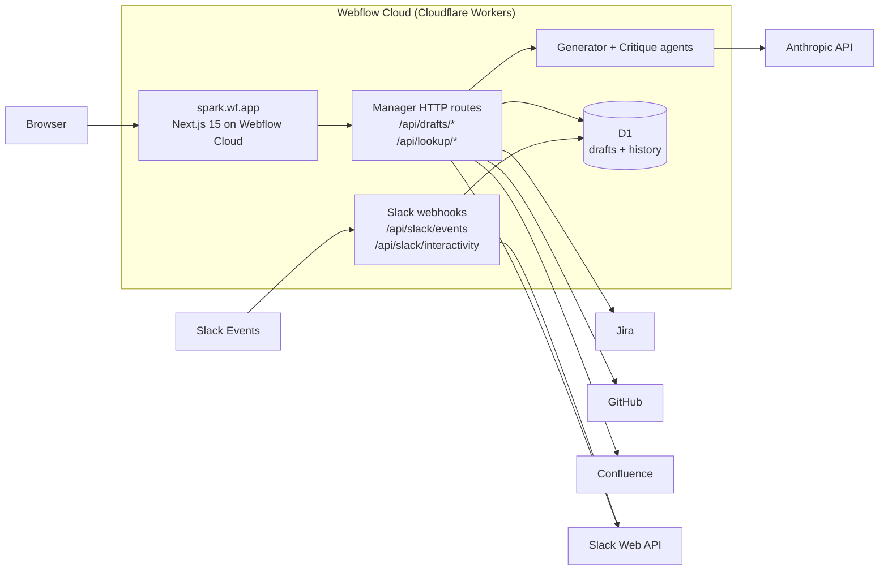

# Hackathon Submission — Spark: Slack Agent on Webflow Cloud

**Team:** Javon McGilberry (+ collaborators)

**Theme adherence:** Agents of Possibility — an autonomous multi-tool
LLM loop drafts a full onboarding plan, runs critique on every save,
and hand-off to a Slack assistant handles the hire's day-1 questions.

**Platform adherence:** the entire system runs on **Webflow Cloud** as
a single Worker. One deploy. One URL. No side-car bot process. No
tunnel. Built as a reference implementation of Cloudflare's "Build a
Slack Agent" pattern, on Webflow's own edge platform.

## Problem

Engineering managers at Webflow spend hours of pre-boarding time on
the personalized onboarding guide every new hire expects on day one:
welcome note, buddy assignment, people to meet, team-tuned checklist
items, first contribution targets. The generic onboarding catalog
covers company-wide basics but doesn't know _this team_, _this
hire_, _this moment_ — so the personalization falls on the manager,
in whatever notes app or spreadsheet they scrape together, with no
review affordance and no delivery path into Slack where the hire
actually works.

## Solution

A Next.js 15 onboarding app on Webflow Cloud with two AI teammates:

1. **Generator agent** — takes the new hire's Slack profile + a
   sentence of context ("Maria, backend, joining Commerce on May 1,
   cares about reliability") and autonomously runs a tool loop
   (resolve_new_hire → draft_welcome_note → find_team_references →
   tune_checklist → finalize_draft). The roster (teammates, manager
   chain, cross-functional partners) is resolved deterministically
   from the DX warehouse before the loop starts, so the LLM never
   names people or fabricates Slack ids. Produces a Zod-validated
   welcome + checklist draft in ~10–20 seconds.
2. **Critique agent** — runs on every save. Deterministic structural
   rules flag missing welcome notes, missing buddies, thin
   people-to-meet lists, uniform task difficulty, dead resource
   links. Each finding has a one-click Apply Fix.

The editor IS the preview: managers edit the welcome, the people
list (with real Slack avatars and Jira/GitHub-sourced "Ask me
about" blurbs), and a 4-column checklist grid — then click
**Publish to Slack**. The app materializes the draft channel +
canvas and notifies reviewers, all from the same Worker.

## What we built (links)

- Code: `spark/` in the webflow monorepo
- Loom demo (4 min): <loom link>
- Webflow Cloud preview: <webflow-cloud-url>

## Architecture

Every handler, service, and tool takes a `HandlerCtx` — the DI
container that holds the Slack client, LLM client, DB, Jira,
GitHub, Confluence, logger, and env. `makeProdCtx(env)` populates
real clients on Cloudflare. `makeTestCtx({...overrides})` builds an
in-memory HandlerCtx for sub-second vitest feedback. The dev
sandbox at `/dev/slack-sandbox` uses the same plumbing with a
recording Slack mock so every event fixture Spark handles is
replayable inline.

## Pitch line

**Spark is a Slack agent built on Webflow Cloud. Entire system on
the edge. Multi-workspace ready.** One Worker handles the manager
dashboard, the Slack Events API webhook, the Anthropic tool-use
loop, the D1 persistence, and the Slack canvas + Home view — and
every layer is reachable from a dev sandbox at `/dev/slack-sandbox`
with HMAC-signed fixtures, so the next engineer can iterate on a
new event type without waiting for Slack or burning API tokens.
